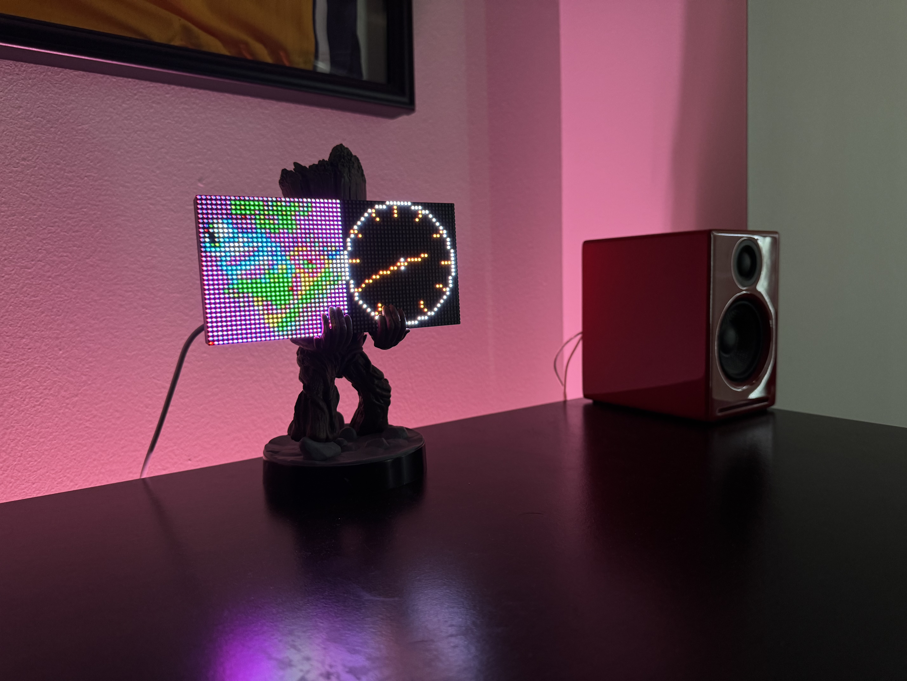

This project is a fork from: 

https://github.com/surekap/MMM-ShairportMetadata/blob/master/shairport-metadata.py

This Python3 script provides metadata from shairport-sync resizes an image to 32x32 image and sends it to my led matrix over http that displays the artwork

   
  <i>Real-time album artwork sent to a 64x32 LED matrix</i>

